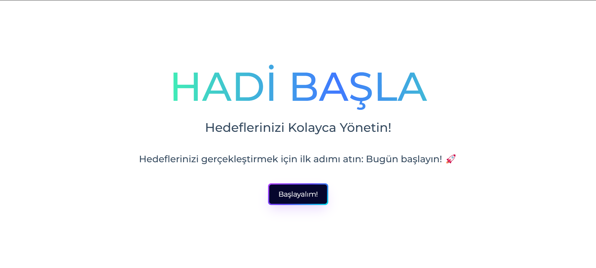
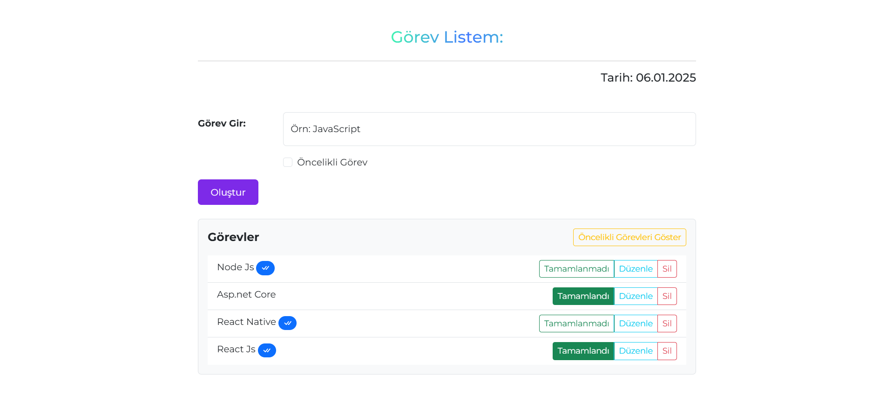
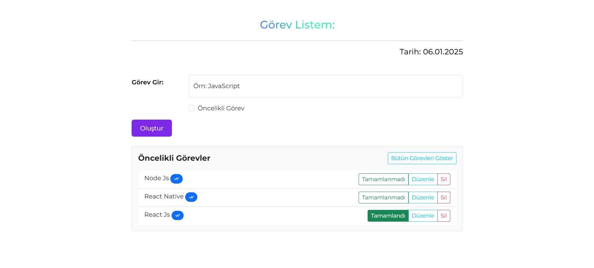

TR

# Hadi Başla

React js ile oluşturduğum bir to do website projesi

## Projede kullandığım teknolojileri ve websiteleri aşağıdan inceleyebilirsiniz

- Bootstrap 5
- React Bits
- uiverse.io
- Flat Ui
- React Hooks (UseState, UseEffect)
- React Router
- Styled Component
- Uuid
- Vite

## Demo

### Ekran Görüntüsü

Projenin Ana sayfa ekranı


Projenin Görev Listesi sayfası


Projenin Görev Listesi sayfası (Öncelikli Görevler)

### Video
[](project-video.mp4)
_Projeyi açıklayan videoyu buradan izleyebilirsiniz._

## Kurulum
   
1. Depoyu klonlayın:
   ```bash
   git clone https://github.com/alpataseven/ReactForm.git
   ```
2. Proje dizinine gidin:
   ```bash
   cd ReactForm
   ```
3. Bağımlılıkları yükleyin:
   ```bash
    npm create vite@latest ReactForm --template react
    npm install styled-components react-router-dom bootstrap@5.3.3 uuid
   ```
4. Uygulamayı başlatın:
   ```bash
   npm run dev
   ```

## Kod Örneği

```javascript
    <div className="mt-5" id="homepage-btn">
        <StyledWrapper>
          <NavLink to="/list">
            <span className="text">Başlayalım!</span>
          </NavLink>
        </StyledWrapper>
      </div>
```

## İletişim

Sorular veya geri bildirimler için iletişim bilgilerim:

- Yazar: [Alperen ATASEVEN](https://github.com/alpataseven)
- E-posta: alperenataseven.3@gmail.com
- GitHub: [alpataseven](https://github.com/alpataseven)

---

ENG

# Hadi Basla

A to-do website project created with React JS

## Technologies and Websites Used in the Project
- Bootstrap 5
- React Bits
- uiverse.io
- Flat Ui
- React Hooks (UseState, UseEffect)
- React Router
- Styled Component
- Uuid
- Vite

## Demo

### Screenshot

The Homepage of the project


The Task List page of the project


The Task List page (Priority Tasks)

### Video
[](project-video.mp4)
_You can watch the video explaining the project here._

## Installation

1. Clone the repository:
   ```bash
    git clone https://github.com/alpataseven/ReactForm.git
   ```
2. Navigate to the project directory:
   ```bash
    cd ReactForm
   ```
3. Install dependencies:
   ```bash
    npm create vite@latest ReactForm --template react
    npm install styled-components react-router-dom bootstrap@5.3.3 uuid
   ```
4. Start the application:
   ```bash
   npm run dev
   ```

## Code Example

```javascript
    <div className="mt-5" id="homepage-btn">
        <StyledWrapper>
          <NavLink to="/list">
            <span className="text">Başlayalım!</span>
          </NavLink>
        </StyledWrapper>
      </div>
```

## Contact

Provide contact information for questions or feedback:

- Author: [Alperen ATASEVEN](https://github.com/alpataseven)
- Email: alperenataseven.3@gmail.com
- GitHub: [alpataseven](https://github.com/alpataseven)
